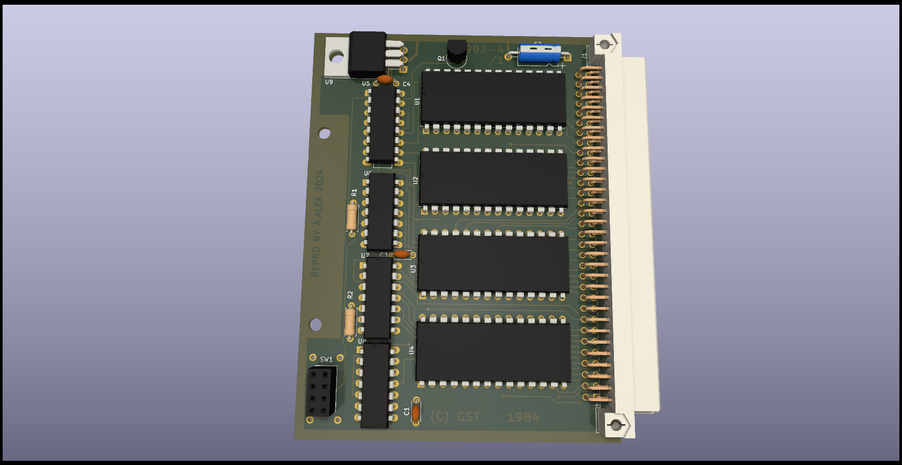
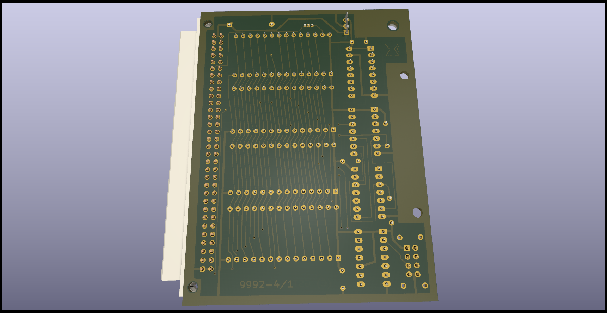
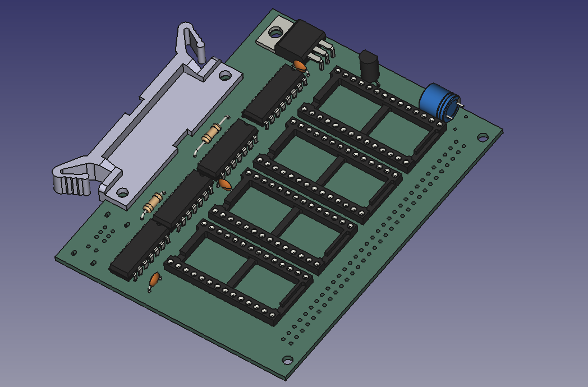

# SINCLAIR QL - GST ROM Board

Reverse Engineered in 2024 by Alvaro Alea Fernandez

License under: CERN Open Hardware Licence Version 2 - Strongly Reciprocal

https://ohwr.org/cern_ohl_s_v2.txt

My work is only copy the design to Kicad, all (C) are retaing to the original owners.

I try to be as acurrate as possible to the original PCB layout, there are some small diferences, to allow me future modding, or use of radial capacitors.

This board provide up to 4 x 16kB Rom (27128) expansion for the QL. 
The intention of this board is to be used with GST's own operation system 68K/OS, 
the 2 top IC are filler with the OS itself and the two bottons are reserverd for ROM-Disk that this OS support.

The switch select next boot OS, on top is 68K/OS and on botom is the internal Qdos OS.

The chips are mapped to 0x00000, 0x04000, 0x08000, 0x0C000, top to bottom, and can be also used to test Minerva, TK2, or the Test Rom.

It's included the freecad and STL files for the puller that include the original board.

